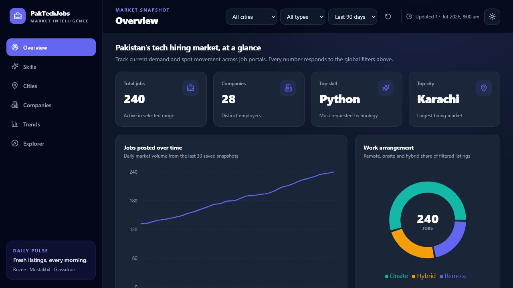
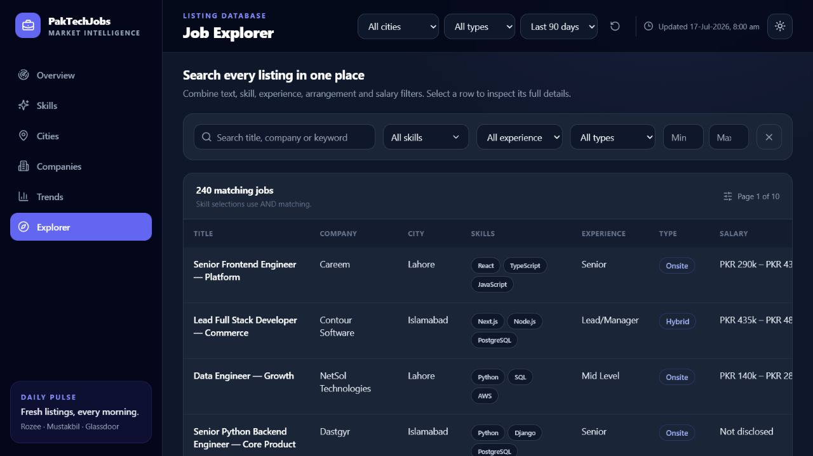

# PakTechJobs

PakTechJobs is a full-stack data pipeline and interactive dashboard for Pakistan's technology job market. It collects public listings from Rozee.pk, Mustakbil.com and Glassdoor Pakistan, with a public Remote OK feed fallback for remote roles accessible from Pakistan. It normalizes listings into a stable schema, stores daily static snapshots, and presents hiring signals through a responsive Next.js dashboard.

The project has no application database. Vercel serves the frontend and the versioned JSON files in `public/data/` provide the data layer.

## What is included

- Six dashboard routes: Overview, Skills, Cities, Companies, Trends and Explorer
- Responsive desktop sidebar and mobile bottom navigation
- Dark mode by default, with a persistent light-mode option
- Global city, work-arrangement and date-range filters
- Recharts visualizations and an accessible city bar-chart fallback
- Searchable, expandable job explorer with multi-skill and salary filters
- Source-isolated scrapers that continue when one portal fails, plus a public remote-job feed fallback
- Normalization for cities, skills, experience, work arrangement, salary and dates
- Deduplication and automatic removal of listings older than 90 days
- 240 deterministic mock listings plus 30 daily snapshots for immediate use
- A 2:00 AM PKT GitHub Actions workflow with an optional Vercel deploy hook

## Architecture

```text
Public job portals
       ↓
Playwright + BeautifulSoup source scrapers
       ↓
scraper/data/jobs_raw.json
       ↓
cleaner.py normalization and validation
       ↓
public/data/jobs.json + public/data/history/YYYY-MM-DD.json
       ↓
Next.js client-side data loader → filters → Recharts dashboard
```

## Windows setup

### Prerequisites

1. Install [Node.js](https://nodejs.org/) 18.17 or newer.
2. Install [Python](https://www.python.org/downloads/) 3.11 or newer and enable **Add Python to PATH** in the installer.
3. Install [Git for Windows](https://git-scm.com/download/win).

### Install and run

Open PowerShell and run:

```powershell
git clone <repo-url>
cd paktechjobs
npm install
python -m pip install -r scraper/requirements.txt
python -m playwright install chromium
python scraper/main.py
npm run dev
```

Open [http://localhost:3000](http://localhost:3000). If all three portals temporarily reject or return no listings, the scraper preserves the existing cleaned dataset instead of replacing it with an empty file.

To regenerate the realistic starter dataset at any time:

```powershell
python scraper/generate_mock.py
```

## Running the scraper

The normal command is:

```powershell
python scraper/main.py
```

Useful local debugging options:

```powershell
python scraper/main.py --limit 25
python scraper/main.py --headed --limit 25
```

Each source scraper opens its own page inside one Chromium context. A source error is logged and the remaining sources continue. The pipeline writes raw results first, then only publishes a cleaned dataset when at least one valid listing survives normalization.

Portal HTML and access policies can change. The scrapers use public pages, JSON-LD when available, and multiple selector fallbacks; they do not attempt to bypass authentication, CAPTCHAs or other access controls. Review each portal's terms before running this at high frequency.

## Data format

`public/data/jobs.json` is an object containing `last_updated`, `count`, and `jobs`. Each job includes:

```json
{
  "id": "stable-sha1-prefix",
  "job_title": "Senior Frontend Engineer",
  "company_name": "Example Company",
  "city": "Lahore",
  "skills": ["React", "TypeScript"],
  "experience_level": "Senior",
  "job_type": "Hybrid",
  "salary_min": 250000,
  "salary_max": 350000,
  "posted_date": "2026-07-17",
  "source": "Rozee.pk",
  "description": "Public listing summary",
  "job_url": "https://example.com/job"
}
```

`public/data/history/index.json` contains compact aggregates used by the trend charts. The full dated snapshot remains available beside it as `YYYY-MM-DD.json`.

## Daily GitHub Actions automation

`.github/workflows/scrape.yml` runs at `0 21 * * *` UTC, which is 2:00 AM in Pakistan. It:

1. Checks out the repository.
2. Sets up Python 3.11.
3. Installs Python and Chromium dependencies.
4. Runs `python scraper/main.py`.
5. Commits changed raw, current and historical JSON files.
6. Calls a Vercel deploy hook when the secret is configured.

The workflow has `contents: write` permission and uses a concurrency group so two daily updates cannot write at the same time.

### Vercel deploy hook

Create a deploy hook in **Vercel project → Settings → Git → Deploy Hooks**. In GitHub, add its URL as an Actions secret named `VERCEL_DEPLOY_HOOK_URL`. The workflow skips that step safely when the secret is absent.

## Deploy to Vercel

1. Push this project to GitHub.
2. Import the repository at [vercel.com/new](https://vercel.com/new).
3. Keep the detected framework as **Next.js** and the build command as `npm run build`.
4. Deploy, then add the deploy-hook secret described above.

No runtime environment variables are required by the dashboard.

## Quality checks

```powershell
npm run typecheck
npm run lint
npm run build
python -m compileall scraper
```

## Screenshots

| Overview | Job Explorer |
|---|---|
|  |  |

## Project structure

```text
paktechjobs/
├── .github/workflows/scrape.yml
├── scraper/
│   ├── main.py
│   ├── rozee.py
│   ├── mustakbil.py
│   ├── glassdoor.py
│   ├── cleaner.py
│   ├── utils.py
│   ├── generate_mock.py
│   └── requirements.txt
├── public/data/
│   ├── jobs.json
│   └── history/
├── src/
│   ├── app/
│   ├── components/
│   ├── context/
│   └── lib/
└── package.json
```

## License

Use the code under the MIT License. Job listing content remains the property of its respective source and employer.
